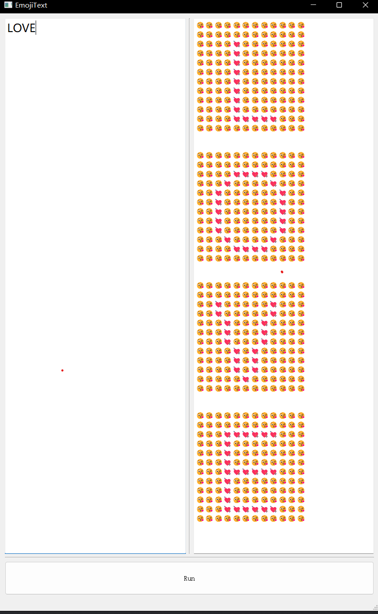

# EmojiText
A software that allows you to compose text using emoji characters conveniently.

## Principle
Input a text string, and the software generates an emoji string. For each character in the input string, it creates a binary image using the PIL library and then converts it into a string composed of two emoji characters.

## Parameters
There are 3 parameters: foreground emoji, background emoji, and the number of columns. (Didn't provide an interface for them in the UI because of laziness 😅)

## Usage
1. Run `main.py`.
2. Enter your text in the left input box.
3. Click "Run."
4. The emoji output will appear in the right output box.

Copy the generated emoji and have fun chatting in your favorite messaging app!

Here's the Unicode emoji list for reference:
[Unicode emoji list](http://www.unicode.org/emoji/charts/full-emoji-list.html#2764)

## Effect

