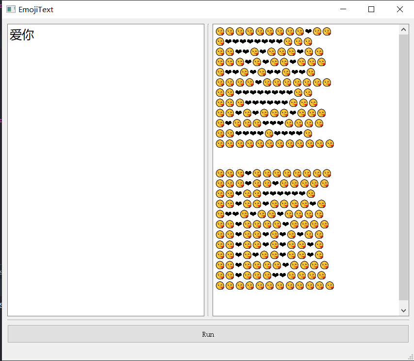

# EmojiText

一个方便你聊天中用表情符拼字的软件。
# 原理
输入文字字符串，输出表情符字符串。
对于输入字符串中的每个字符，使用PIL库绘制其二值图，再将二值图转换为两种表情符组成的字符串即可。
# 参数
主要参数有三个：前景表情符，后景表情符，以及列数。（因为太懒，所以没有在界面中给出接口o(*￣▽￣*)ブ）
# 使用
运行main.py，在界面左侧输入框中输入文字，点击“Run”，在界面右侧输出框中会输出表情符。

把输出的表情符复制到聊天软件里就可以愉快聊天了！

附上[Unicode表情列表](http://www.unicode.org/emoji/charts/full-emoji-list.html#2764) 。
# 效果

